# 3-Tier DevSecOps Platform

  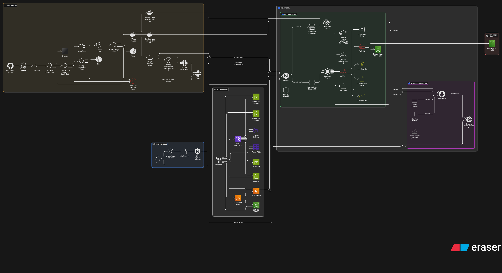

Production‑ready demonstration of a secure, containerized 3‑tier web application (React Frontend + Node.js / Express API + MySQL) fully automated through a DevSecOps toolchain: Docker, Jenkins CI/CD, SonarQube, Trivy, GitLeaks, Kubernetes (EKS), Terraform IaC, Prometheus & Grafana monitoring, and Slack notifications.

## 🚀 At a Glance

- **Frontend:** React (SPA) served via Nginx container (`client/`)
- **Backend:** Node.js / Express REST API (`api/`) providing Auth (JWT), Users, and Task (Todo) management
- **Database:** MySQL 8 with initialization SQL & runtime migrations (tables provisioned automatically)
- **Security & Quality Gates:** GitLeaks (secret scanning), SonarQube (SAST & code quality), Trivy (FS + image vulnerability scans), JWT auth & RBAC (admin vs viewer)
- **CI/CD:** Declarative Jenkins Pipeline (`Jenkinsfile_CICD`) building, scanning, pushing Docker images, deploying to EKS, Slack notifications
- **Orchestration:** Kubernetes manifests under `k8s-prod/` (Deployments, Services, Ingress TLS, StatefulSet + StorageClass)
- **Infrastructure as Code:** Terraform (`terraform/`) provisioning AWS VPC + EKS Cluster + Node Group + IAM + CSI Driver
- **Monitoring & Observability:** Production Prometheus + Grafana stack (kube-prometheus-stack Helm chart) with node exporter & kube-state-metrics (`monitoring/`)

Supporting layers:

- **Security scanning** embedded inside CI stages prior to image push
- **Image provenance**: Jenkins builds & tags `fendimohamed/frontend:latest` and `fendimohamed/backend:latest`
- **Stateful data** persisted via AWS EBS CSI provisioned StorageClass `ebs-sc`
- **Ingress** terminates TLS (Let’s Encrypt via cert-manager annotations) and routes `/api` vs `/` traffic

## 📸 Implementation Evidence (Screenshots)

Proof that the full platform is deployed. Images are ordered from end-user experience backward into infrastructure, tooling, and notifications.

1. Application UI (Production)

- 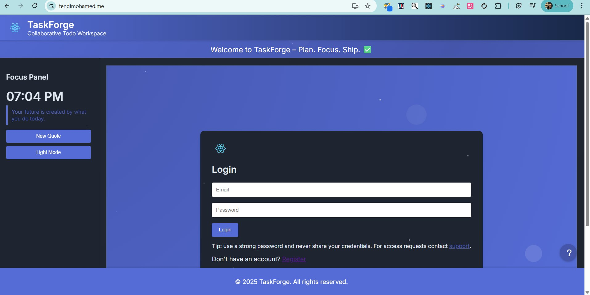
- 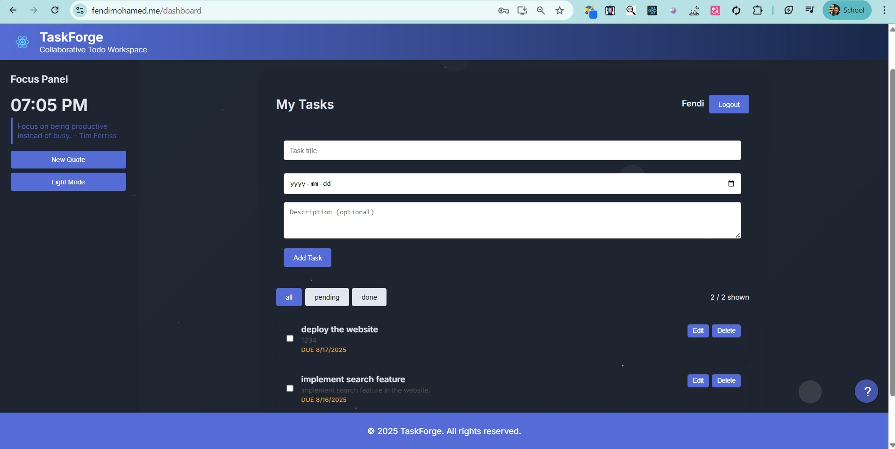

2. AWS Console

- 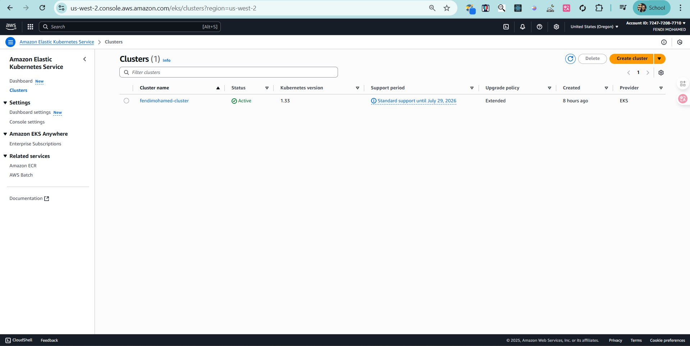
- 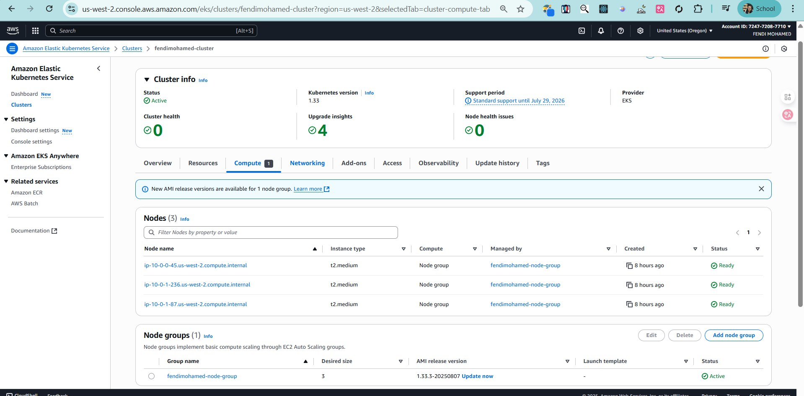
- 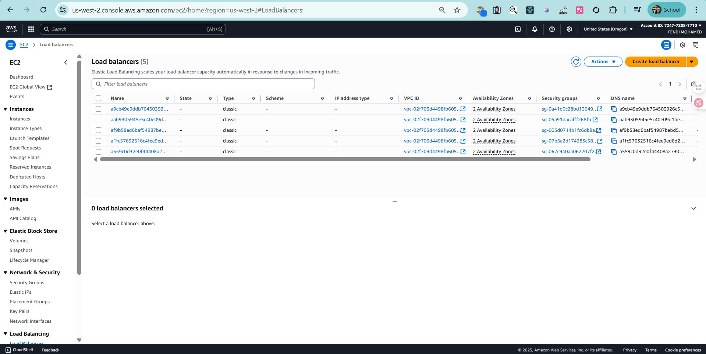
- 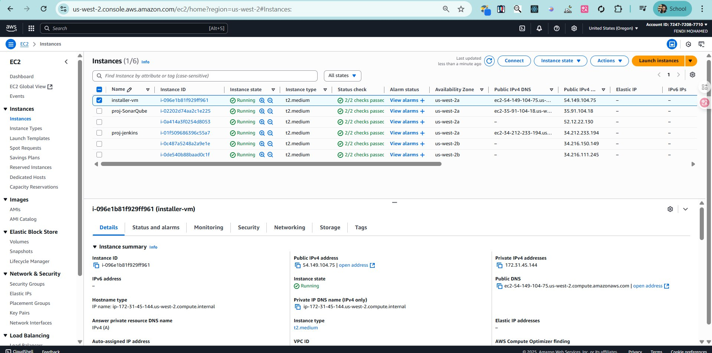
- 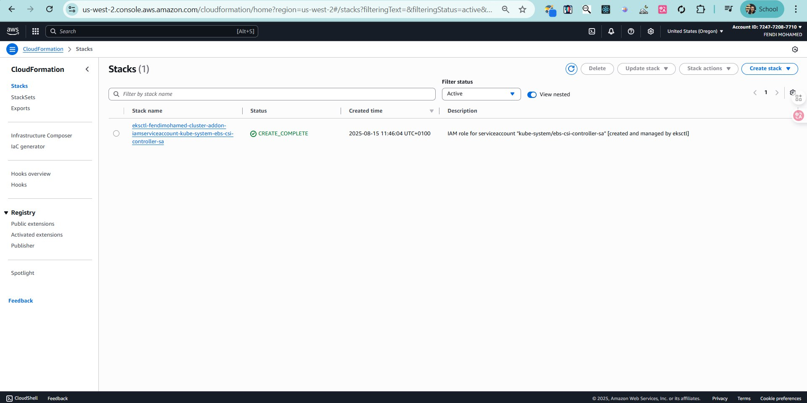

3. Kubernetes (kubectl / terminal)

- 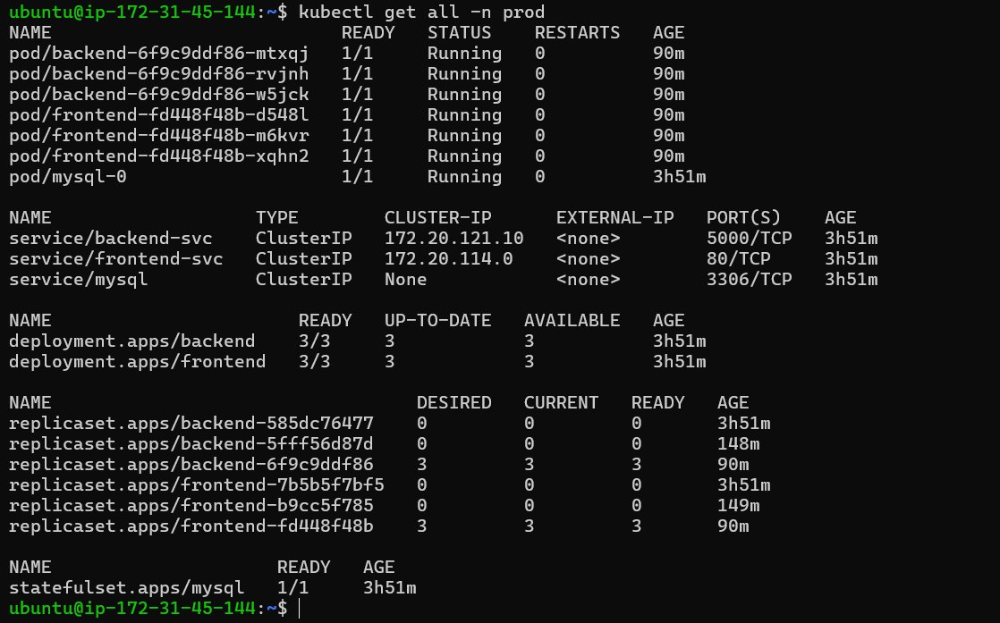
- 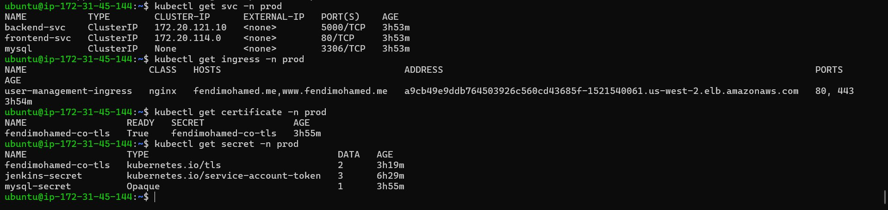
- 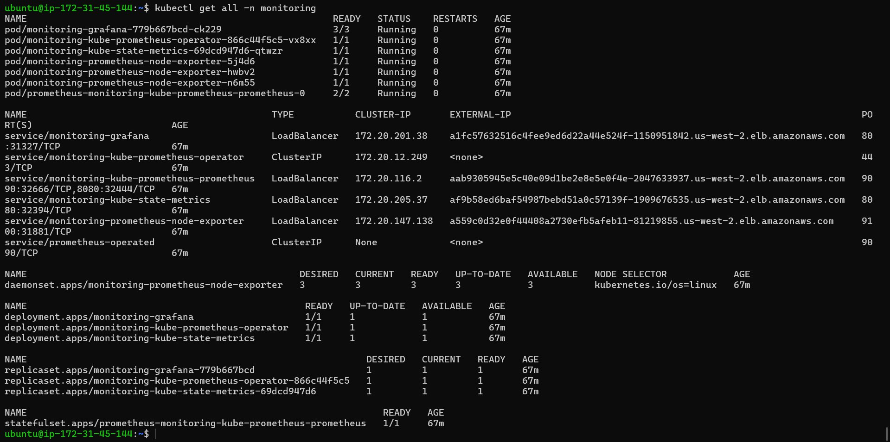
- 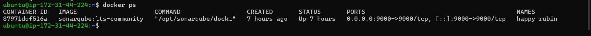
- 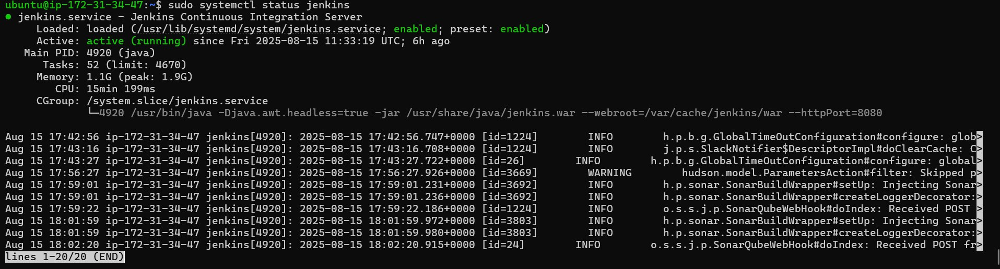

4. Jenkins & Quality

- 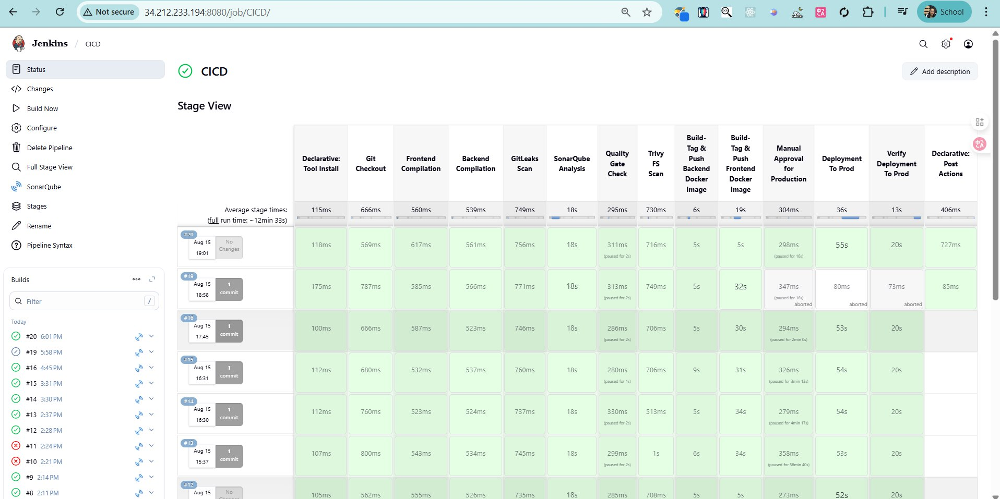
- 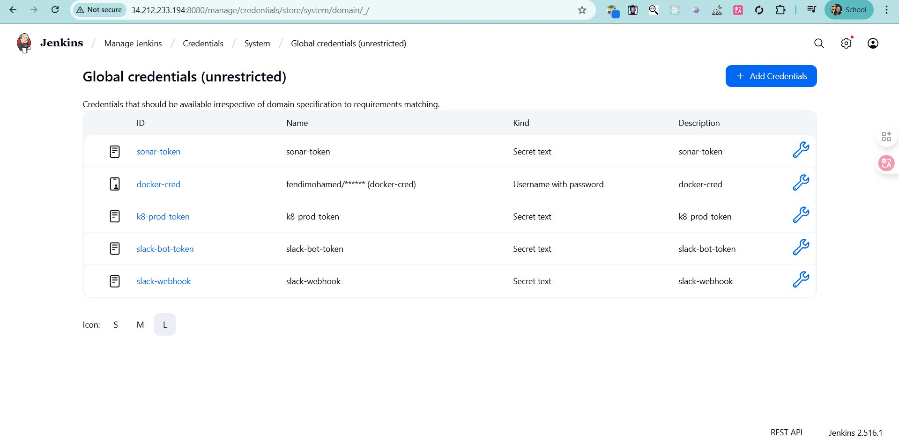
- 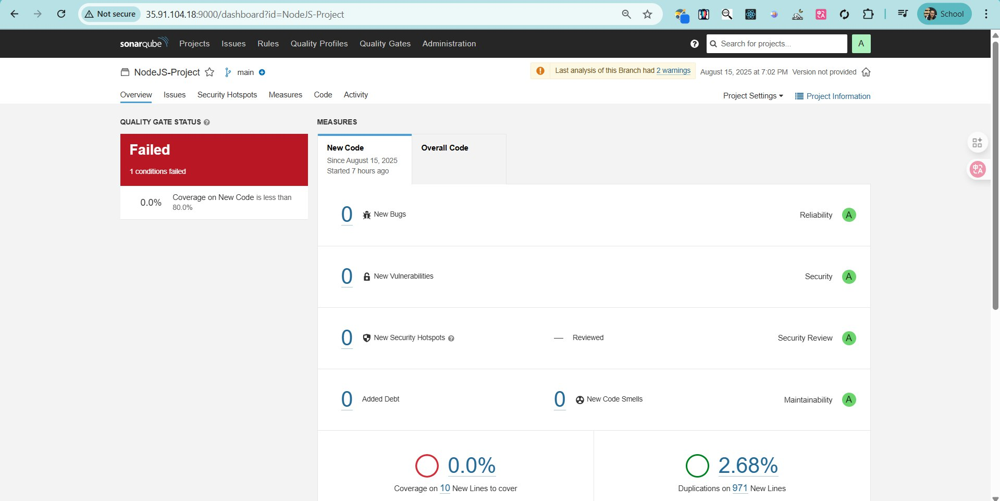
- 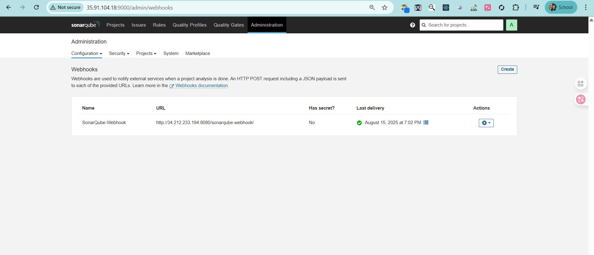
- 
- 

5. Monitoring

- 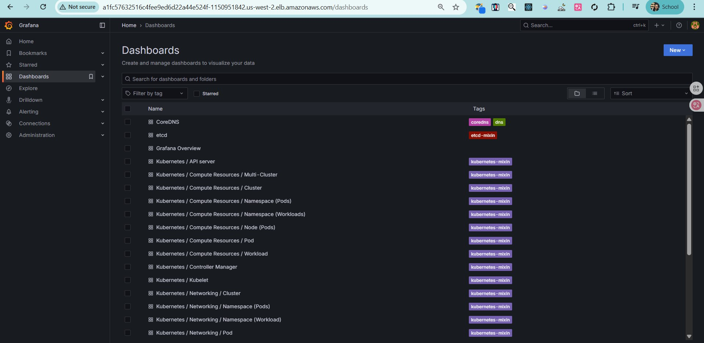
- 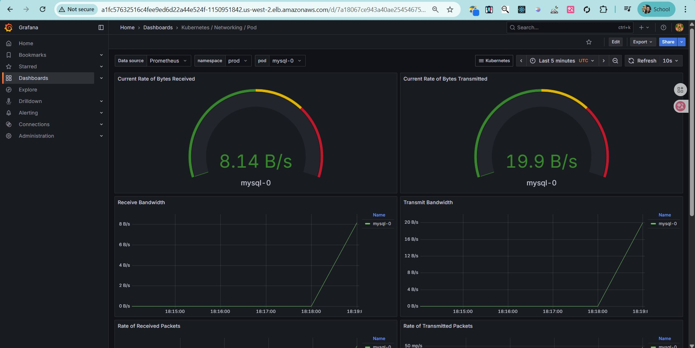
- 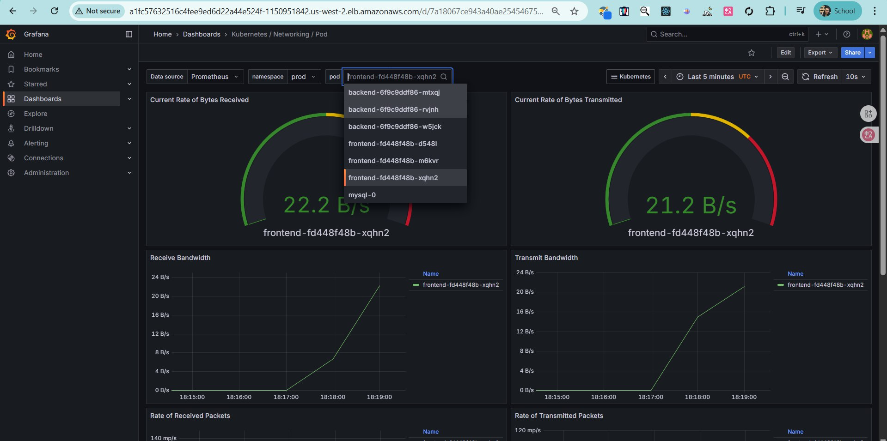
- 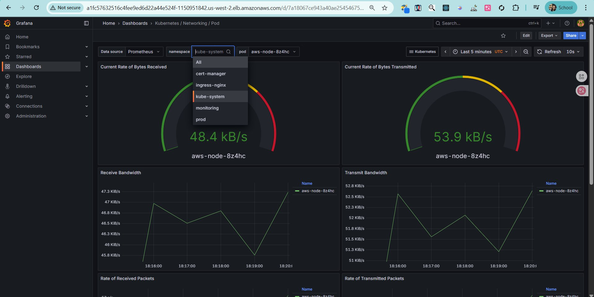

6. Notifications

- 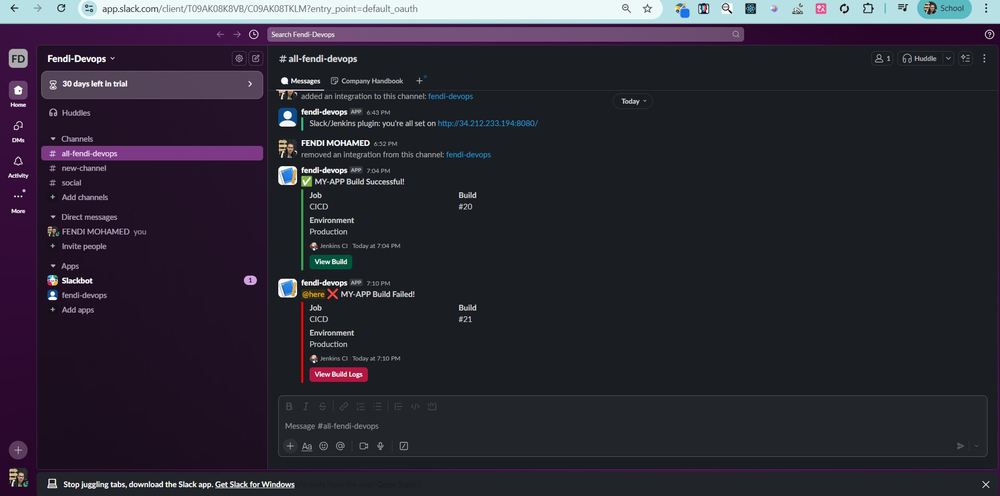

## 🔐 Application Features

| Domain     | Capability                                                                     |
| ---------- | ------------------------------------------------------------------------------ |
| Auth       | Register & login with hashed passwords (bcrypt), JWT issuance (1h expiry)      |
| Users      | CRUD (admin‑protected for modifications)                                       |
| Tasks      | Per‑user tasks with CRUD, status transitions, due dates                        |
| RBAC       | `admin` vs `viewer` enforced via middleware                                    |
| Resilience | Auto admin bootstrap + optional password reset via env flag `RESET_ADMIN_PASS` |

## 🗂 Key Directories

| Path               | Purpose                                                                               |
| ------------------ | ------------------------------------------------------------------------------------- |
| `api/`             | Express API, routes, controllers, DB connector, security middleware                   |
| `client/`          | React frontend (auth context, protected routes, dashboards)                           |
| `k8s-prod/`        | Production Kubernetes manifests (Ingress, Deployments, Services, MySQL, StorageClass) |
| `terraform/`       | AWS infrastructure (VPC, Subnets, EKS, Node Group, IAM, EBS CSI)                      |
| `mysql-init/`      | Local dev DB bootstrap SQL (used by Docker Compose)                                   |
| `monitoring/`      | Placeholder values & future steps for observability stack                             |
| `Jenkinsfile_CICD` | End‑to‑end DevSecOps pipeline definition                                              |

## 🧭 End‑to‑End Walkthrough

1. A developer pushes to the `prod` branch in GitHub. A webhook wakes Jenkins.
2. Jenkins executes the declarative pipeline.
3. Security gates fire early:

- GitLeaks hunts for exposed secrets.
- SonarQube performs static analysis and enforces the Quality Gate.
- Trivy scans the working filesystem for vulnerable packages.

4. Only after passing gates do we build two Docker images (frontend & backend); each image is then scanned again by Trivy (image mode) before push.
5. Images are pushed to the registry and immediately deployed to EKS using a service account with scoped RBAC; `kubectl apply` reconciles Deployments, StatefulSet and Ingress.
6. The cluster admits new pods: stateless frontend / backend replicas scale horizontally; the MySQL StatefulSet mounts its existing PVC, preserving data.
7. Prometheus (monitoring namespace) scrapes application, node and MySQL metrics; Grafana dashboards visualize latency, resource saturation and pod health.
8. On completion (success or failure) a structured Slack message posts build number, environment and direct links, closing the feedback loop.
9. Runtime resilience: admin user auto‑bootstraps, tasks table is ensured idempotently, and rolling updates replace pods without downtime thanks to stateless design.
10. Operators observe trends (CPU, error rate) and can iterate safely; any regression would surface in dashboards and future pipeline gates.

This lifecycle demonstrates a production‑style DevSecOps chain: shift‑left security, immutable artifacts, declarative infrastructure, observable runtime, and automated feedback.

## 🛡 Security Controls Summary

| Layer                 | Control                                         |
| --------------------- | ----------------------------------------------- |
| Source                | GitLeaks secret scanning                        |
| Code Quality          | SonarQube (bugs, code smells, vulnerabilities)  |
| Dependencies / Images | Trivy (fs + image)                              |
| Auth                  | JWT (HMAC), short expiry, middleware validation |
| RBAC                  | Role check (`isAdmin`) gating privileged routes |
| Data                  | Password hashing (bcrypt, salt)                 |
| Network               | EKS security groups + Ingress path segmentation |
| Storage               | EBS CSI + PersistentVolumeClaim (retain policy) |

## 📦 API Overview (Representative Routes)

| Method | Path                 | Description                 | Auth                        |
| ------ | -------------------- | --------------------------- | --------------------------- |
| POST   | `/api/auth/register` | Register new user           | Public                      |
| POST   | `/api/auth/login`    | JWT login                   | Public                      |
| GET    | `/api/users`         | List users                  | Bearer + Admin for mgmt ops |
| POST   | `/api/todos`         | Create task                 | Bearer                      |
| GET    | `/api/todos`         | List tasks (scoped to user) | Bearer                      |
| PUT    | `/api/todos/:id`     | Update task                 | Bearer (owner)              |
| DELETE | `/api/todos/:id`     | Remove task                 | Bearer (owner)              |

JWT Payload: `{ id, role }` with 1h expiry.

## 🗄 Database Schema Highlights

Users:

- `id`, `name`, `email(UNIQUE)`, `password`, `role (admin|viewer)`, `created_at`
  Tasks:
- `id`, `user_id (FK cascade)`, `title`, `description`, `status (pending|done in runtime / extended in k8s config)`, `due_date`, `created_at`
  Automatic creation (runtime) ensures resilience if migrations not yet applied; Kubernetes ConfigMap handles cluster init.

## 🖥 Frontend Notes

- React Context for Auth state & token persistence
- Protected routes wrapper ensures gated navigation
- Dashboard pages for user management & personal tasks
- Axios instance with auth header injection (see `client/src/axios.js`)

## 🔄 Dev Productivity

- Rapid local bootstrap via Docker Compose
- Consistent prod parity with K8s manifests
- Automated admin bootstrap & optional reset (`RESET_ADMIN_PASS=true`)
- Single Jenkinsfile orchestrates build → scan → deploy → notify

## � Monitoring & Observability

Implemented via the upstream `kube-prometheus-stack` Helm chart (see `monitoring/values.yaml`). Key customizations:

| Component          | Status   | Notes                                                           |
| ------------------ | -------- | --------------------------------------------------------------- |
| Prometheus         | Enabled  | LB Service, persistent storage (5Gi gp3 via `ebs-sc`)           |
| Grafana            | Enabled  | LB Service, admin creds from values (can externalize to Secret) |
| Node Exporter      | Enabled  | Cluster / node metrics surfaced externally (demo)               |
| Kube State Metrics | Enabled  | Kubernetes object state metrics exported                        |
| Alertmanager       | Disabled | Can be enabled & integrated with Slack / PagerDuty              |

Deployment steps summary (`monitoring/steps.txt`):

1. Add & update Helm repo `prometheus-community`
2. `helm upgrade --install monitoring prometheus-community/kube-prometheus-stack -f values.yaml -n monitoring --create-namespace`
3. Patch services to `LoadBalancer` (already reflected in values & post‑patch commands) for external demo access

Persistence: Prometheus uses a PVC via the `ebs-sc` StorageClass (gp3) ensuring metric retention across pod restarts.

Security Hardening Suggestions (future):

- Replace LoadBalancer exposure with Ingress + auth proxy (e.g., OAuth2 proxy)
- Externalize Grafana admin credentials into a Kubernetes Secret
- Enable Alertmanager and create routing for critical alerts (pod crash loops, high 5xx rate, DB latency)

## 🧪 Testing

Minimal current tests (sample placeholder in `client/src/AlwaysPass.test.js`). Future enhancements:

- Jest unit tests for controllers (mock DB)
- Integration tests (supertest) for auth & task flows
- Cypress or Playwright for end‑to‑end user journeys

## 🛠 Local Troubleshooting

| Issue                   | Tip                                                                 |
| ----------------------- | ------------------------------------------------------------------- |
| Backend cannot reach DB | Ensure MySQL container healthy; match `DB_NAME` vs init SQL DB name |
| JWT invalid             | Confirm `Authorization: Bearer <token>` header & token not expired  |
| Pods CrashLoopBackOff   | `kubectl logs <pod>` then verify env/config & image tag             |
| Sonar stage fails       | Check quality gate details in SonarQube UI                          |
